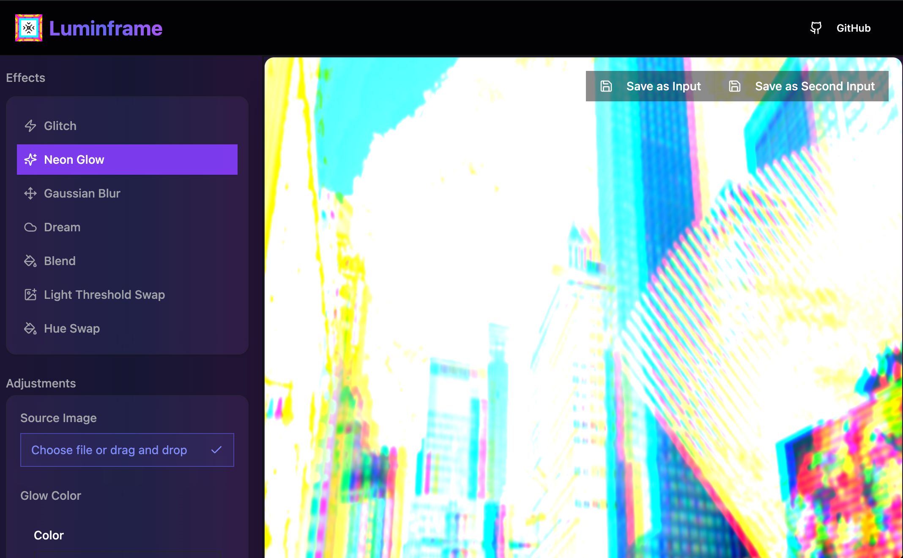

# Luminframe

A browser-based image editor powered by Three.js and GLSL shaders. Apply real-time visual effects and filters to your images using WebGL shaders.



## Features

- ✨ **16 Real-time Shader Effects** - Black & white, blur, glitch, kaleidoscope, and more
- 🎨 **Adjustable Parameters** - Fine-tune each effect with intuitive controls
- 📐 **Multiple Aspect Ratios** - Square, landscape, portrait, cinematic formats
- 🖱️ **Drag & Drop Upload** - Easy image loading
- ⚡ **GPU-Accelerated** - Hardware-accelerated processing with WebGL
- 💾 **Export & Reuse** - Save processed images as new inputs
- 📱 **Responsive Design** - Works on desktop and mobile

## Tech Stack

- **React 18** - UI framework
- **TypeScript** - Type safety
- **Three.js** - 3D rendering engine
- **GLSL Shaders** - GPU-accelerated effects
- **React Three Fiber** - React renderer for Three.js
- **Vite** - Build tool
- **TailwindCSS** - Styling
- **Radix UI** - Headless components
- **Jest** - Testing framework

## Quick Start

```bash
# Install dependencies
npm install

# Start development server
npm run dev

# Run tests
npm test

# Build for production
npm run build
```

## Architecture

Luminframe follows a **clean, layered architecture** with proper separation of concerns:

```
Domain Layer (Business Logic)
    ↓
Service Layer (Shader System)
    ↓
Application Layer (React Hooks)
    ↓
Presentation Layer (Components)
    ↓
Infrastructure Layer (Three.js, WebGL)
```

**📖 For detailed architecture documentation, see [ARCHITECTURE.md](./ARCHITECTURE.md)**

Key architectural features:
- 🏗️ **Domain-Driven Design** - Business logic separated from infrastructure
- 🎭 **Adapter Pattern** - Clean abstraction over Three.js
- 🔌 **Plugin Architecture** - Easy to add new shader effects
- 🧪 **Highly Testable** - Domain layer fully unit-testable
- 📦 **Value Objects** - Immutable `Dimensions`, `Color`, `Image` models

## Project Structure

```
src/
├── domain/              # Business logic (no framework dependencies)
│   ├── models/         # Domain entities (Image)
│   └── value-objects/  # Immutable values (Dimensions, Color)
├── adapters/           # Infrastructure adapters (TextureAdapter)
├── hooks/              # Application logic (useShader, useCanvasExport)
├── lib/                # Services & utilities
│   └── shaders/        # Shader effect library (16 effects)
├── components/         # Presentational components
├── ClientApp/          # Application shell
└── ImageScene.tsx      # Three.js canvas wrapper
```

## Adding a New Shader Effect

1. Create effect file: `src/lib/shaders/effects/my-effect.ts`

```typescript
import { createShaderRecord, createShaderVariable } from '@/lib/shaderConfig';

export const myEffect = createShaderRecord({
  name: "My Effect",
  variables: [
    createShaderVariable('imageTexture').asImage('Source Image'),
    createShaderVariable('intensity').asRange('Intensity', 1.0, 0, 2, 0.1),
  ],
  body: `
    void main() {
      vec2 uv = vUv;
      vec4 color = texture2D(imageTexture, uv);
      gl_FragColor = color * intensity;
    }
  `
});
```

2. Register in `src/lib/shaders/index.ts`
3. Add to type union in `src/types/shader.ts`

That's it! The UI controls are generated automatically. See [ARCHITECTURE.md](./ARCHITECTURE.md) for details.

## Testing

```bash
# Run all tests
npm test

# Watch mode
npm run test:watch

# Coverage
npm run test:coverage
```

Tests are organized by layer:
- **Unit tests** - Domain models, value objects, services
- **Integration tests** - Hooks, shader builder
- **Component tests** - React components

## Documentation

### Architecture & Design
- **[ARCHITECTURE.md](./ARCHITECTURE.md)** - Complete architecture guide for developers
- **[ARCHITECTURE_AUDIT.md](./ARCHITECTURE_AUDIT.md)** - Architectural analysis & future roadmap

### Refactoring Phases
- **[PHASE_1_TODOS.md](./PHASE_1_TODOS.md)** - ✅ Phase 1: Module reorganization & domain models (COMPLETED)
- **[PHASE_2_TODOS.md](./PHASE_2_TODOS.md)** - 🚧 Phase 2: Rendering adapter & parameter plugins (IN PROGRESS)
- **[CLIENTAPP_REFACTORING_SUMMARY.md](./CLIENTAPP_REFACTORING_SUMMARY.md)** - ClientApp abstraction improvements

### Development Status

**Current Phase:** Phase 2 - Rendering Abstraction & Extensibility

**Completed:**
- ✅ Domain models (Image, Dimensions, Color)
- ✅ Clean architecture layers
- ✅ Proper separation of concerns
- ✅ TextureAdapter for Three.js abstraction
- ✅ No infrastructure leakage in UI components

**In Progress:**
- 🚧 Rendering engine abstraction
- 🚧 Parameter plugin system
- 🚧 Shader concerns separation

## Contributing

1. Fork the repository
2. Create your feature branch (`git checkout -b feature/amazing-feature`)
3. Commit your changes (`git commit -m 'Add some amazing feature'`)
4. Push to the branch (`git push origin feature/amazing-feature`)
5. Open a Pull Request

---

Built with [Three.js](https://threejs.org/) and [shadcn/ui](https://ui.shadcn.com/)
