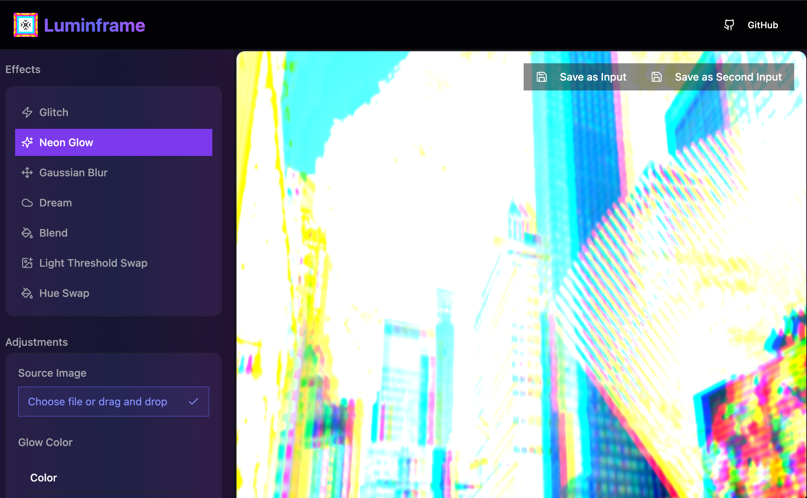

# Luminframe

A browser-based image editor powered by Three.js and GLSL shaders. Load an image,
stack real-time WebGL effects on it, and publish the result to the AT Protocol
(Bluesky and Grain).



## Features

- ✨ **16 real-time shader effects** — organized into families (Tone, Color, Soften,
  Distort, Stylize, Composite) with live per-effect thumbnails of your own image.
- 🎚️ **Stackable, reorderable edits** — apply effects into a pipeline; undo/redo,
  reorder, and hold-to-compare against the original.
- 🎛️ **Generated controls** — each effect's parameters render their own controls
  (sliders, color, image, toggle) from a single declaration.
- 🖱️ **Drag-and-drop upload** — the whole workspace is the drop target.
- ⚡ **GPU-accelerated** — a synchronous multi-pass WebGL chain; no per-pass readback.
- 📤 **Publish over AT Protocol** — sign in with Bluesky, publish to Bluesky or Grain
  with least-privilege OAuth scopes.
- 💾 **Export & reuse** — download the render, or feed it back in as a second input.

## Tech Stack

- **React 18** + **TypeScript** — UI and type safety
- **Three.js** — WebGL rendering (used directly through an adapter; not react-three-fiber)
- **GLSL** — the effect shaders
- **@atproto/api** + **@atproto/oauth-client-browser** — Bluesky/Grain publishing
- **Vite** — build & dev server
- **TailwindCSS** + **Radix UI** — styling and headless components
- **Jest** — testing

## Quick Start

```bash
npm install
npm run dev      # development server (Vite, localhost:5173)
npm test         # run the test suite
npm run build    # typecheck + production build
```

## Architecture

Luminframe is a **hexagonal (ports-and-adapters) architecture**: dependencies point
inward, the domain knows nothing of frameworks, and Three.js and the AT Protocol SDK
live only behind adapters.

```
Presentation (React: ClientApp, components/, hooks/)
        ↓  through ApplicationContext + small hooks
Application (src/application/: ports/ + usecases/ + ApplicationContext)
        ↓  depends on domain + port interfaces only
Domain (src/domain/: models/ + value-objects/ — no framework imports)
        ↑  implemented by
Infrastructure (src/infrastructure/: Three.js, browser FS, AT Protocol)
```

**📖 The canonical reference is [ARCHITECTURE.md](./ARCHITECTURE.md)** — a pattern
language of 24 named patterns (the Dependency Rule, Ports Are Earned, One Engine One
Door, No Dead or Lying Code, …), each grounded in a real file. Read it before changing
an architectural boundary, and amend it in the same commit when you do.

## Project Structure

```
src/
├── domain/              # Business logic — no framework imports
│   ├── models/          #   Image, EditPipeline
│   └── value-objects/   #   Color, Dimensions, ImageFormat
├── application/         # The application core
│   ├── ports/           #   interfaces (Rendering, ShaderRepository, ImageLoader, …)
│   ├── usecases/        #   RenderEdit, LoadImage, ExportCanvas, SaveCanvasAsInput
│   └── ApplicationContext.ts   # the DI container
├── infrastructure/      # Adapters implementing the ports
│   ├── adapters/        #   ThreeJS rendering, texture, browser FS, publish (Bluesky/Grain)
│   └── atproto/         #   OAuth client + scopes
├── parameters/          # Parameter-control registry + renderers
├── lib/                 # Pure helpers
│   └── shaders/         #   effect library (16 effects) + curated catalog
├── hooks/               # useRenderingEngine, useImageLoader, usePublish, …
├── ClientApp/           # App shell: ClientApp, useShaderEditor, EditorSidebar
└── components/          # Presentational components + RenderCanvas
```

## Adding a New Shader Effect

1. Create `src/lib/shaders/effects/<name>.ts` using the builder.
2. Register it in `src/lib/shaders/index.ts`.
3. Add its key to `registeredShaders` in `src/types/shader.ts`.
4. Place it in a family and give it a blurb in `src/lib/shaders/catalog.ts`.
   **A keystone test enforces this** — an effect missing from the catalog fails CI.
5. Add a fallback glyph in `src/components/effect-picker.tsx`.

The parameter controls are generated automatically from the effect's declaration.
See [ARCHITECTURE.md §24](./ARCHITECTURE.md) for this and the other recipes (adding a
parameter type, adding a publish target).

## Testing

```bash
npm test              # all tests
npm run test:watch    # watch mode
npm run test:coverage # coverage
```

The suite favors high signal over coverage: each test catches a real bug class,
documents a deliberate decision, or pins math the reader can't eyeball. Pure logic is
tested directly; the GPU ping-pong is tested as pure data (`renderChainPlan`).

## Contributing

Grow the codebase in small, verified slices: each change is its own commit, leaves
`tsc` clean and the suite green, and — when it's observable — is checked in the browser.
Align with the patterns in [ARCHITECTURE.md](./ARCHITECTURE.md); if the code outgrows a
pattern, amend the pattern in the same commit.

---

Built with [Three.js](https://threejs.org/), the [AT Protocol](https://atproto.com/),
and [shadcn/ui](https://ui.shadcn.com/).
